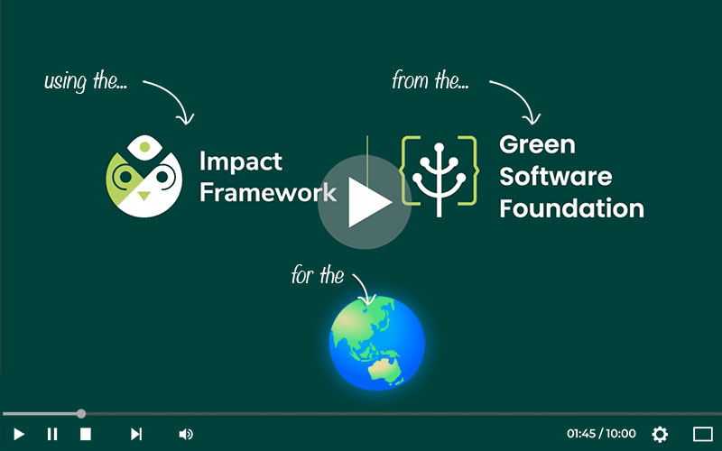

# Impact Framework

For an overview of the impact Framework, [check out our wiki](https://github.com/heaversm/carbonhack-if/wiki)

[](https://www.youtube.com/watch?v=5WImTN8840E)

## Running Impact Framework Getting Started Pipeline

Install Framework

`npm install -g "@grnsft/if"`

Install Plugins

`npm install -g "@grnsft/if-plugins"`

Install unofficial plugins

`npm i -g @grnsft/if-unofficial-plugins`

Create a manifest file - `manifest.yml`

Create a .env file


### Register for Watt Time


1. **Make an .env file**

```
WATT_TIME_USERNAME=<YOUR_DESIRED_USERNAME>
WATT_TIME_PASSWORD=<YOUR_DESIRED_PW>
WATT_TIME_EMAIL=<YOUR_DESIRED_EMAIL>
WATT_TIME_ORG=<YOUR_DESIRED_ORG>
```

2. Run the `watt-register.py script`:

`python3 utilities/watt-register.py`

Run the `watt-login.py` script:

`python3 utilities/watt-login.py`

3. Run the sample manifest file:

`ie --manifest manifest-input/manifest-in.yaml --output manifest-output/manifest-out`


---

## Other Info

### Plugins.json

In the root of this repo is a `plugins.json` file, which lists each Impact Framework plugin's metadata (such as where to find its source code, documentation, and data sources used for calculation), as well as all the information about its inputs, outputs, and required configuration.

```json
"config": {
  "energy-per-gb": {
    "type": "float",
    "units": "kWh/GB",
    "description": "the amount of energy used by memory per GB",
    "example": 0.000392,
    "required": true
  }
},
```

This allows you to look in a single location to assess what plugins you might need in your pipeline and how to implement them.

### Plugin Test Manifests

Within the `manifest-input/tests` and `manifest-output/tests` folders are yaml files for each of the official IF plugins, which show a minimal implementation of that plugin if it were used in isolation, along with the output it would produce. They can be run the same way the sample website measurement manifest is run, for example:

```bash
ie --manifest manifest-input/tests/mock-observations.yml --output manifest-output/tests/mock-observations-out
```

This can be helpful for getting a better sense of whether your plugin is configured properly for use in your pipeline, as well as understanding what sort of data it will produce as it relates to any other plugins you plan on using for your ultimate manifest file.

### Relevant Plugins for Website Measurement

* [Teads Curve](https://github.com/Green-Software-Foundation/if-unofficial-plugins/blob/main/src/lib/teads-curve/README.md) - estimates CPU usages across varying type of CPUs
* [Watt Time](https://github.com/Green-Software-Foundation/if-unofficial-plugins/blob/main/src/lib/watt-time/README.md) - provides a way to calculate emissions for a given time in a specific geolocation.
* [Cloud Metadata](https://github.com/Green-Software-Foundation/if-plugins/blob/main/src/lib/cloud-metadata/README.md) - determine an instance's physical processor and thermal design power based on its instance name.
* [Sci](https://github.com/Green-Software-Foundation/if-plugins/blob/main/src/lib/sci/README.md) - amount of carbon emitted per[ functional unit](https://sci-guide.greensoftware.foundation/R/) (e.g. API request)
* [Sci-E](https://github.com/Green-Software-Foundation/if-plugins/blob/main/src/lib/sci-e/README.md)- simply sums up the contributions to a component's energy use (CPU/memory/network in kWh over a duration, in seconds). Acts as input to operational emissions ↩️
* [Sci-O](https://github.com/Green-Software-Foundation/if-plugins/blob/main/src/lib/sci-o/README.md) - Operational emissions of component while in use (energy in kWh X grid intensity in gCO2e/kWh) - yields gCO2eq
* [Sci-M](https://github.com/Green-Software-Foundation/if-plugins/blob/main/src/lib/sci-m/README.md) - carbon emitted during the manufacture and eventual disposal of a component and is added to operational carbon, yielding gCO2eq
* [TDP](https://github.com/Green-Software-Foundation/if-plugins/blob/main/src/lib/tdp-finder/README.md) - Thermal Design Power of a processor - sourced from Codecarbon, Boavista, and Kaggle.
